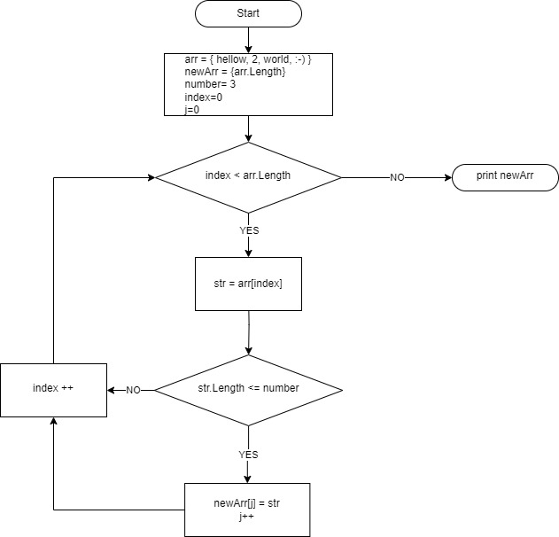

# Текстовое описание решения 
1. 

***Пишем код решения задачи***

2. Берем за основу массив из примера .
3. Создаем новый массив, который в конце и выведем после формирования из первоначального массива, исходя из условий задачи .
4. Вводим переменную i = 0 и number = 3 .
5. Создаем цикл перебора каждого элемента первоначального массива через оператор цикла 'foreach' .
6. Если длина элемента первоначального массива меньше или равно переменной 'number' , присваиваем элементу с текущим индексом нового массива значение элемента из первоначального массива, который является текущим в цикле 'foreach' .
7. Увеличиваем значение переменной i на 1 .
8. Выводим получившийся новый массив
9. Для проверки выводим элемент нового получившегося массива с индексом 1 .